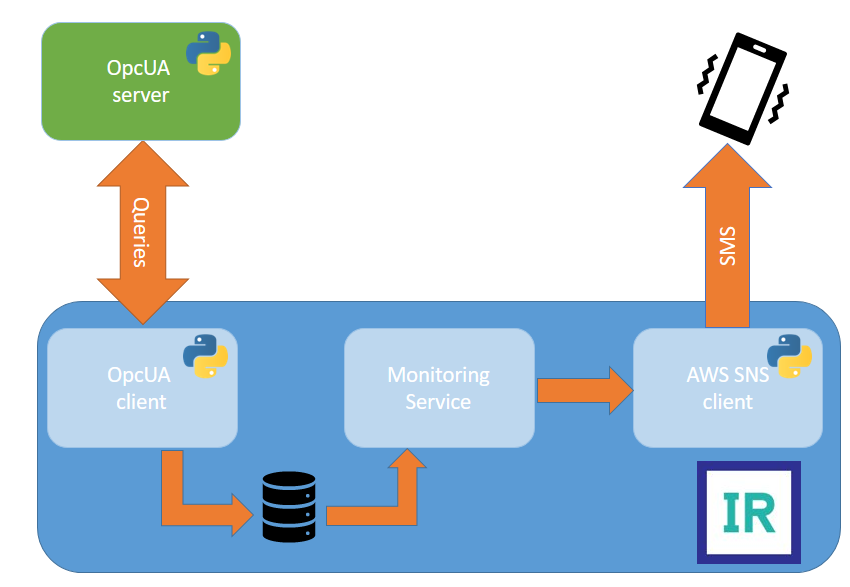

# OpcUA-empy
Demo OpcUA BS with Embedded Python.

This demo starts an OpcUA server (100 nodes) and queries them using InterSystems IRIS and EmbeddedPython.



# Running

1. Install [Docker](https://www.docker.com/get-started) with docker-compose.
2. Clone or download this repository: `git clone git@github.com:eduard93/OpcUA-empy.git`
3. Copy `iris.key` into the repository.
4. Start containers: `docker compose up -d`
5. Check that `QueryService` business service in `USER` namespace is running.

# SQL

1. `dc_opcua.Node` table contains auto-discovered nodes.
2. `dc_opcua.Value` table contains node values.


# Customization

1. To customize the OpcUA server, provide an `entrypoint` for the `opcua` container in `docker-compose.yml`, for example: 

```
entrypoint: ["python", "/app/server.py", "--nodes", "10", "--sleep", "0.1"]
```

Available parameters are:
- `--nodes` - number of nodes to create (default: 100).
- `--sleep` - pause between node value changes (default: 0.1).

2. To customize query frequency, set `Call Interval` value in `QueryService` business service (default: 5 seconds).

3. To customize server, namespace, and parent node (InterSystems IRIS queries all children of this node), edit `OpcUA` setting category in `QueryService` business service.